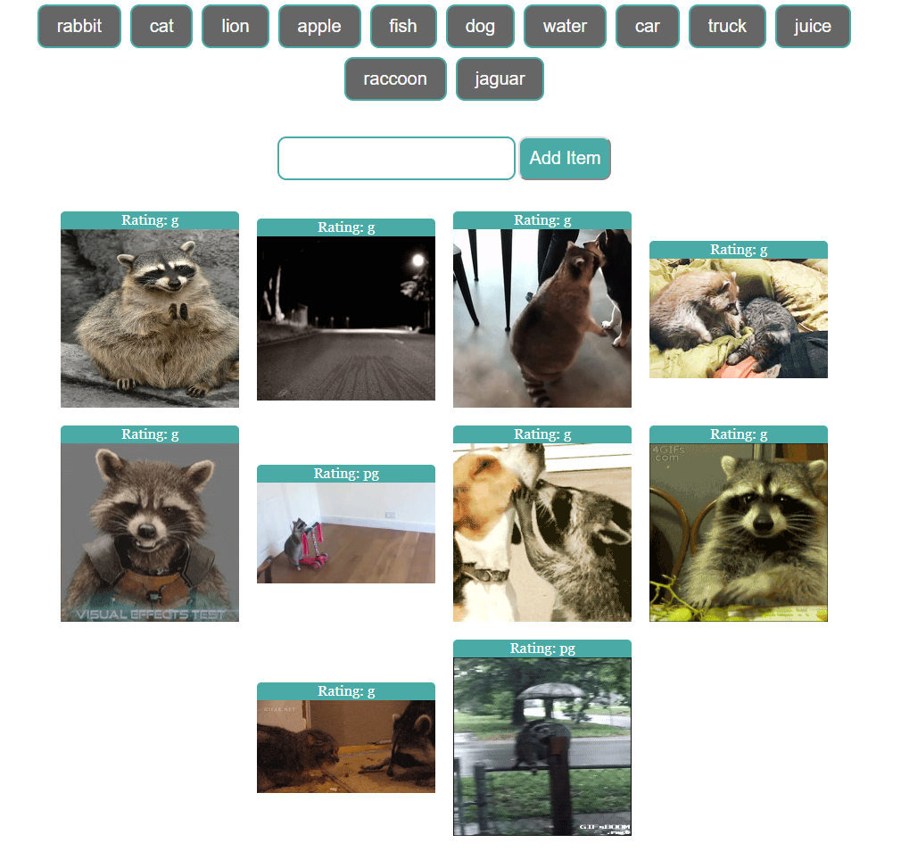

# GIPHY-API

## Overview:

This application is a practical example of using ajax component of JQuery, where it connect to the `GIPHY` API by requesting GIF images for a `thing`.

## Project Dependencies:

This app requires to include this CDN library: `jquery`.

## Basic Usage:

* The app runs by opening the `index.html` in the web-browser, then the application will ask the user to search for anything in searching field or select from suggested things.

* By clicking on any of resulted images, the image will animate as source image. And another click will freeze the image from being animated.

## Screenshot of Usage:

  

## Try it:

This [link](https://ibsafi.github.io/GIPHY-API/) will jump you to test the application, have fun!